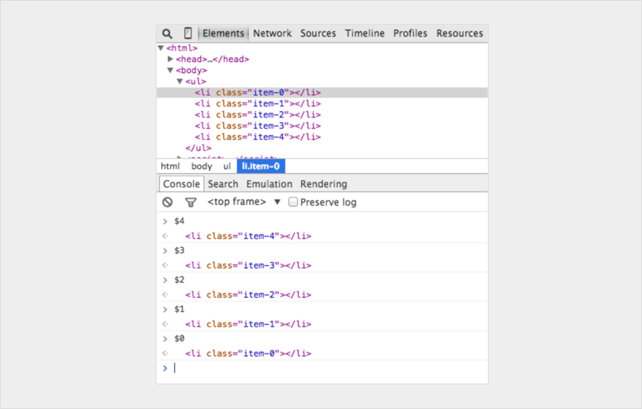
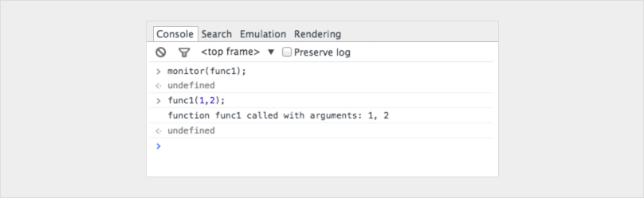
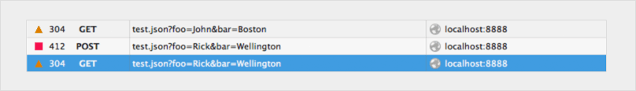

# The 14 JavaScript debugging tips you probably didn't know

## 1. `debugger;`

```js
if (thisThing) {
    debugger;
}
```

## 2. Display objects as a table

```js
var animals = [
  { animal: 'Horse', name: 'Henry', age: 43 },
  { animal: 'Dog', name: 'Fred', age: 13 },
  { animal: 'Cat', name: 'Frodo', age: 18 }
];

console.table(animals);
```

Will output:


## 3. Try all the sizes

Jump into your inspector and click the __‘toggle device mode’__ button.


## 4. How to find your DOM elements quickly



## 5. Benchmark loops using `console.time()` and `console.timeEnd()`

```js
console.time('Timer1');

var items = [];

for (var i = 0; i < 100000; i++){
  items.push({index: i});
}

console.timeEnd('Timer1');
```

This has produced the following result:


## 6. Get the stack trace for a function

```js
var car;
var func1 = function() {
  func2();
}

var func2 = function() {
  func4();
}
var func3 = function() {
}

var func4 = function() {
  car = new Car();
  car.funcX();
}
var Car = function() {
  this.brand = ‘volvo’;
  this.color = ‘red’;
  this.funcX = function() {
    this.funcY();
  }

  this.funcY = function() {
    this.funcZ();
  }

  this.funcZ = function() {
    console.trace(‘trace car’)
  }
}
func1();
var car;
var func1 = function() {
  func2();
}
var func2 = function() {
  func4();
}
var func3 = function() {
}
var func4 = function() {
  car = new Car();
  car.funcX();
}
var Car = function() {
  this.brand = ‘volvo’;
  this.color = ‘red’;
  this.funcX = function() {
    this.funcY();
  }
  this.funcY = function() {
    this.funcZ();
  }
  this.funcZ = function() {
    console.trace(‘trace car’)
  }
}
func1();
```

Line 33 will output:


Now we can see that __func1__ called __func2__, which called __func4__. __Func4__ then created an instance of __Car__ and then called the function __car.funcX__, and so on.

## 7. Unminify code as an easy way to debug JavaScript


## 8. Quick-find a function to debug

The two most common ways to do that is:

1. Find the line in your inspector and add a breakpoint
2. Add a debugger in your script

```js
var func1 = function() {
  func2();
};

var Car = function() {
  this.funcX = function() {
    this.funcY();
  }

  this.funcY = function() {
    this.funcZ();
  }
}

var car = new Car();
```

Type debug(car.funcY) in the console and the script will stop in debug mode when it gets a function call to car.funcY:


## 9.  Black box scripts that are NOT relevant

Today we often have a few libraries and frameworks on our web apps. Most of them are well tested and relatively bug-free. But, the debugger still steps into all the files that have no relevance for this debugging task. The solution is to black box the script you don’t need to debug. This could also include your own scripts. [Read more about debugging black box in this article](https://raygun.com/blog/javascript-debugging-with-black-box/).

## 10. Find the important things in complex debugging

```js
console.todo = function(msg) {
  console.log(‘ % c % s % s % s‘, ‘color: yellow; background - color: black;’, ‘–‘, msg, ‘–‘);
}

console.important = function(msg) {
  console.log(‘ % c % s % s % s’, ‘color: brown; font - weight: bold; text - decoration: underline;’, ‘–‘, msg, ‘–‘);
}

console.todo(“This is something that’ s need to be fixed”);
console.important(‘This is an important message’);
```

Will output:


## 11. Watch specific function calls and its arguments

```js
var func1 = function(x, y, z) {
//....
};
```

Will output:



## 12. Quickly access elements in the console


## 13. Postman is great (but Firefox is faster)

Below I present a request twice with different properties:



## 14. Break on node change


