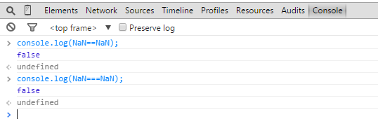
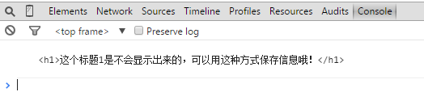
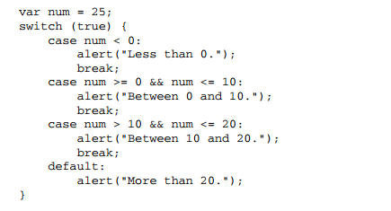
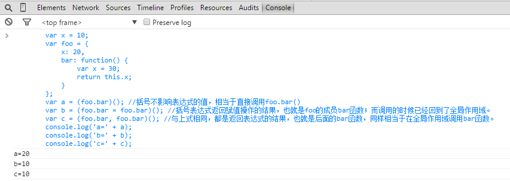
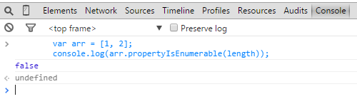
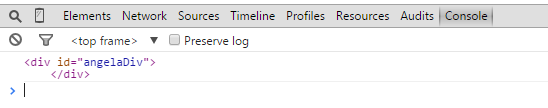
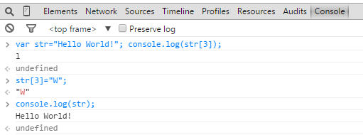

# js 的冷知识

## !!将一个值方便快速转化为布尔值

```javascript
console.log(!!window === true);
```

## 不声明第三个变量实现交换

```javascript
var a = 1,
  b = 2;
a = [b, (b = a)][0]; //执行完这句代码之后 a的值为2 b的值为1了
```

## &&和||的用法

```javascript
var day = new Date().getDay() === 0;
//传统if语句
if (day) {
  alert("Today is Sunday!");
}
//运用逻辑与代替if
day && alert("Today is Sunday!"); //也就是说只有day为真的情况才执行后面的代码alert  一句简单的代码就实现了上面的if功能  强大吧
```

```javascript
if (!a) {
  a = {};
}
//上面的三句话可以用下面的一句话替换哦
a = a || {}; //解释这句话一下哦   如果有a这个变量的声明的话 那么它还是原来的对象  如果没有就给它创建一个对象
```

**顺便写一下下面的例子**

与其这样书写：if(string.length > 0){..}
不如这样书写：if(string.length){..}

## NAN 不等于任何值，包括它自身

大家都知道在任何编程语言中，如果被除数为 0 则会报错，而在 js 里面不会，它返回的值为 NAN，NaN 表示一个不能产生正常结果的运算结果，我们可以用 isNaN(number)来检测是不是 NAN，但是大家也许都不知道 NAN 不等于任何值，包括它自身。



## 利用 script 标签保存任意信息

**将 script 标签设置为 type='text'然后可以在里面保存任意信息，之后可以在 JavaScript 代码中很方便地获取。**

页面代码如下所示：

```html
<script type="text" id="angelaScript">
  <h1>这个标题1是不会显示出来的，可以用这种方式保存信息哦！</h1>
</script>

<script type="text/javascript">
  console.log(document.getElementById("angelaScript").innerHTML);
</script>
```

结果显示如下图所示：



## js 当中 Switch 的一些用法


看上图运行的效果，总结一句哦！

1. **switch 参数变量与 case 后面的比较是全等比较，也就是说===的比较**
2. **并非每一个 case 后面都需要书写 break，如果不写的话，它会顺序往下执行的**
3. **switch 语句不光可以使用数字、字符做条件表达式，还可以使用字符串！**

看下面的 switch 的使用，你瞬间觉得 switch 这么厉害！



## 了解作用域，清楚明白当前的 this 是谁



## 你可能不知道的 js 数组

- **数组的 length 属性不可枚举**
- **JS 的数组可以用字符串形式的数字下标来访问，因为数组的元素其实是数组对象的属性。**
- **delete 可以用来从数组中移除元素，但由于一个元素就是一个属性，delete 会在数组中遗留一个“空洞”；被 delete 删除的元素为 undefined，使用 splice 方法可能是一个更好的办法。例如要删除 arr 数组的第 3 个元素，可以使用这样的语句：arr.splice(2,1);不过对于大型数组来说，这个函数的效率可能不高。**



## html 中设置了 id 的元素居然是 js 的全局变量哦

html 页面代码如下所示

```html
<div id="angelaDiv"></div>
<script type="text/javascript">
  console.log(angelaDiv);
</script>
```

在 chrome 控制台看到的结果如下图所示



## 字符串居然能用下标访问

大家都知道字符串是不可变的，在 js 中也是如此。也就是说一旦字符串被创建，就无法改变。但是我相信很少人知道在**js 当中居然可以用下标来访问字符串当中的某一个字符，虽然可以用下标读取但去不能修改哦**(虽然修改操作不会报错，但是却不起作用)



## 字符串的一些方法

- **string 的 substring 函数的用法和 slice 一样，但是它不能处理负数参数。ECMAscript 中也没有对 substr 方法进行标准化，所以如果要取一个字符串的子串，就用 slice 方法吧！**

- **string 的 split(separator,limit)方法把 string 分割成片段，来创建一个字符串数组。可选参数 limit 可以限制被分割的片段数量。separator 参数可以是一个字符串或一个正则表达式，并且来自分组捕获的文本将会被包含在被分割后的数组中**

```javascript
var s = "str1 , str2 , str3";
s.split(/\s(,)\s/, 4);
//输出结果：["str1",",","str2",","]
```

## 把浏览器当成编辑器

浏览器地址栏输入以下代码，立马就把浏览器变成 notepad 了，厉害吧！

```
data:text/html, <html contenteditable>
```
