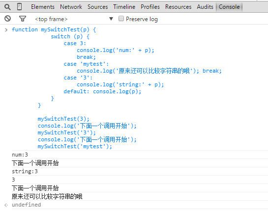

# js的冷知识

## !!将一个值方便快速转化为布尔值

```javascript
console.log( !!window===true );
```

## 不声明第三个变量实现交换

```javascript
var a=1,b=2;
a=[b,b=a][0]; //执行完这句代码之后 a的值为2 b的值为1了
```

## &&和||的用法

```javascript
var day=(new Date).getDay()===0;
//传统if语句
if (day) {
    alert('Today is Sunday!');
};
//运用逻辑与代替if
day&&alert('Today is Sunday!');//也就是说只有day为真的情况才执行后面的代码alert  一句简单的代码就实现了上面的if功能  强大吧
```

```javascript
if (!a) {
    a = {};
}
//上面的三句话可以用下面的一句话替换哦
a = a || {}; //解释这句话一下哦   如果有a这个变量的声明的话 那么它还是原来的对象  如果没有就给它创建一个对象
```

__顺便写一下下面的例子__

与其这样书写：if(string.length > 0){..}
不如这样书写：if(string.length){..}

## NAN不等于任何值，包括它自身

大家都知道在任何编程语言中，如果被除数为0则会报错，而在js里面不会，它返回的值为NAN，NaN表示一个不能产生正常结果的运算结果，我们可以用isNaN(number)来检测是不是NAN，但是大家也许都不知道NAN不等于任何值，包括它自身。


## 利用script标签保存任意信息

__将script标签设置为type='text'然后可以在里面保存任意信息，之后可以在JavaScript代码中很方便地获取。__

页面代码如下所示：

```html
<script type="text" id="angelaScript">
<h1>这个标题1是不会显示出来的，可以用这种方式保存信息哦！</h1>
</script>

<script type="text/javascript">
console.log(document.getElementById('angelaScript').innerHTML); 
</script>
```

结果显示如下图所示：


## js当中Switch的一些用法



看上图运行的效果，总结一句哦！

1. __switch参数变量与case后面的比较是全等比较，也就是说===的比较__
2. __并非每一个case后面都需要书写break，如果不写的话，它会顺序往下执行的__
3. __switch语句不光可以使用数字、字符做条件表达式，还可以使用字符串！__

看下面的switch的使用，你瞬间觉得switch这么厉害！


## 了解作用域，清楚明白当前的this是谁


## 你可能不知道的js数组

* __数组的length属性不可枚举__
* __JS的数组可以用字符串形式的数字下标来访问，因为数组的元素其实是数组对象的属性。__
* __delete可以用来从数组中移除元素，但由于一个元素就是一个属性，delete会在数组中遗留一个“空洞”；被delete删除的元素为undefined，使用splice方法可能是一个更好的办法。例如要删除arr数组的第3个元素，可以使用这样的语句：arr.splice(2,1);不过对于大型数组来说，这个函数的效率可能不高。__


## html中设置了id的元素居然是js的全局变量哦

html页面代码如下所示

```html
<div id="angelaDiv">
</div>
<script type="text/javascript">
    console.log(angelaDiv);
</script>
```

在chrome控制台看到的结果如下图所示


## 字符串居然能用下标访问

大家都知道字符串是不可变的，在js中也是如此。也就是说一旦字符串被创建，就无法改变。但是我相信很少人知道在__js当中居然可以用下标来访问字符串当中的某一个字符，虽然可以用下标读取但去不能修改哦__(虽然修改操作不会报错，但是却不起作用)


## 字符串的一些方法

* __string的substring函数的用法和slice一样，但是它不能处理负数参数。ECMAscript中也没有对substr方法进行标准化，所以如果要取一个字符串的子串，就用slice方法吧！__

* __string的split(separator,limit)方法把string分割成片段，来创建一个字符串数组。可选参数limit可以限制被分割的片段数量。separator参数可以是一个字符串或一个正则表达式，并且来自分组捕获的文本将会被包含在被分割后的数组中__

```javascript
var s = 'str1 , str2 , str3';s.split(/\s(,)\s/,4);  
//输出结果：["str1",",","str2",","]  
```

## 把浏览器当成编辑器

浏览器地址栏输入以下代码，立马就把浏览器变成notepad了，厉害吧！

```
data:text/html, <html contenteditable>
```
