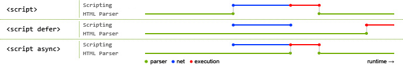

## Script loading

[This WebKit blog post](http://webkit.org/blog/1395/running-scripts-in-webkit/) explains the difference between `defer` and `async` best:

> Both `async` and `defer` scripts begin to download immediately without pausing the parser and both support an optional onload handler to address the common need to perform initialization which depends on the script. The difference between `async` and `defer` centers around when the script is executed. Each `async` script executes at the first opportunity after it is finished downloading and before the window's load event. This means it's possible (and likely) that `async` scripts are not executed in the order in which they occur in the page. The `defer` scripts, on the other hand, are guaranteed to be executed in the order they occur in the page. That execution starts after parsing is completely finished, but before the document's `DOMContentLoaded` event.



- Normal execution `<script>`
  This is the default behavior of the `<script>` element. Parsing of the HTML code pauses while the script is executing. For slow servers and heavy scripts this means that displaying the webpage will be delayed.
- Deferred execution `<script defer>`
  Simply put: delaying script execution until the HTML parser has finished. A positive effect of this attribute is that the DOM will be available for your script. However, since not every browser supports defer yet, don’t rely on it!
- Asynchronous execution `<script async>`
  Don’t care when the script will be available? Asynchronous is the best of both worlds: HTML parsing may continue and the script will be executed as soon as it’s ready. I’d recommend this for scripts such as Google Analytics.

## Quick reference

### Plain script elements

```html
<script src="//other-domain.com/1.js"></script>
<script src="2.js"></script>
```

**Spec says:** Download together, execute in order after any pending CSS, block rendering until complete.

**Browsers say:** Yes sir!

### Defer

```html
<script src="//other-domain.com/1.js" defer></script>
<script src="2.js" defer></script>
```

**Spec says:** Download together, execute in order just before DOMContentLoaded. Ignore “defer” on scripts without “src”.

**IE < 10 says:** I might execute 2.js halfway through the execution of 1.js. Isn’t that fun??

**The [browsers in red](http://caniuse.com/#search=defer) say:** I have no idea what this “defer” thing is, I’m going to load the scripts as if it weren’t there.

**Other browsers say:** Ok, but I might not ignore “defer” on scripts without “src”.

### Async

```html
<script src="//other-domain.com/1.js" async></script>
<script src="2.js" async></script>
```

**Spec says:** Download together, execute in whatever order they download in.

**The [browsers in red](http://caniuse.com/#search=async) say:** What’s ‘async’? I’m going to load the scripts as if it weren’t there.

**Other browsers say:** Yeah, ok.

### Async false

```js
["1.js", "2.js"].forEach(function(src) {
  var script = document.createElement("script");
  script.src = src;
  script.async = false;
  document.head.appendChild(script);
});
```

**Spec says:** Download together, execute in order as soon as all download.

**Firefox < 3.6, Opera says:** I have no idea what this “async” thing is, but it just so happens I execute scripts added via JS in the order they’re added.

**Safari 5.0 says:** I understand “async”, but don’t understand setting it to “false” with JS. I’ll execute your scripts as soon as they land, in whatever order.

**IE < 10 says:** No idea about “async”, but there is a workaround using “onreadystatechange”.

**Other [browsers in red](http://caniuse.com/#search=async) say:** I don’t understand this “async” thing, I’ll execute your scripts as soon as they land, in whatever order.

**Everything else says:** I’m your friend, we’re going to do this by the book.
